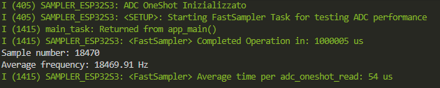
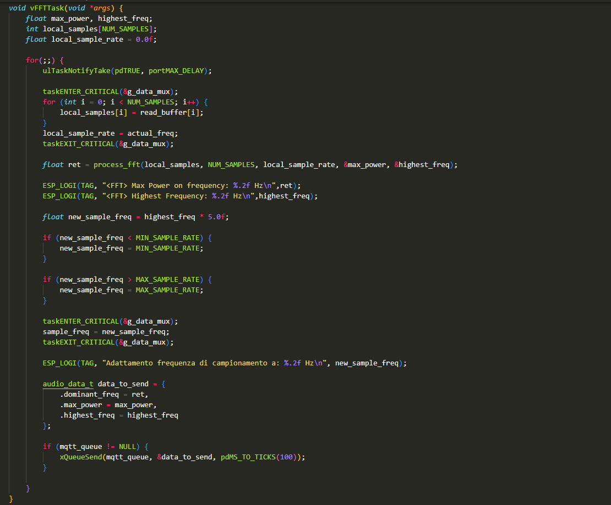

# IoT Individual Assignment

## Abstract

This file contains the documentation of the process to complete the assignment for the _"IoT Algorithms and Services"_ course of _"Sapienza Università di Roma"_.

The file contains all the requested points or at least the one i have been able to complete.

## Assignment

### Maximum Sampling Frequency

#### Clock and vTaskDelay

During some experiments I found out that esp32 clock rate is setted to _10ms_. This fact implies that if `vTaskDelay()` is used to set the frequency, then it is impossible to sample faster then _1/0.01 Hz_ (_100Hz_).

It is possible to set clock rate down to 1ms, but the board will consume more energy, other options examined proved to be better.

In fact setting `vTaskDelay(pdMS_to_ticks(1))` will end up triggering the watchdog because the clock can not schedule faster the _10ms_.

#### Faster without DMA

Another sampling mode is to not use `vTaskDelay()` but `esp_rom_delay_us(delayus)`, this will allow us to achieve delays in the order of microseconds, enhancing the highest possible sampling frequency to:

$$1/10^{-6} Hz = 1000000 Hz$$

But this limit is only theorical because a single ADC read, performed using `adc_oneshot()` takes aproximately $54 \mu s$

So computing again the theorethical max frequency we get:

$$1/{10^{-6} s + 54 * 10^{-6} s} = 18181.82 Hz$$

This result can be measured:

### Optimal frequency

The code computes the __FFT__ over the samples passed from the _Sampler Task_ in a dedicated task, _FFT Task_.

_FFT Task_ is initializated when the board starts up and awaits for a notify from the _Sampler Task_. The __FFT__ is computed immediately after the _Sampler Task_ finishes its work and returns the frequency with more power and the highest one.

Finally the frequency is set:

$$adaptive\_sampling\_freq = highest\_freq * 5.0$$

to prevent data loss and to get a good reconstruction of the signal.

## Bonuses
