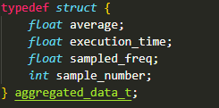
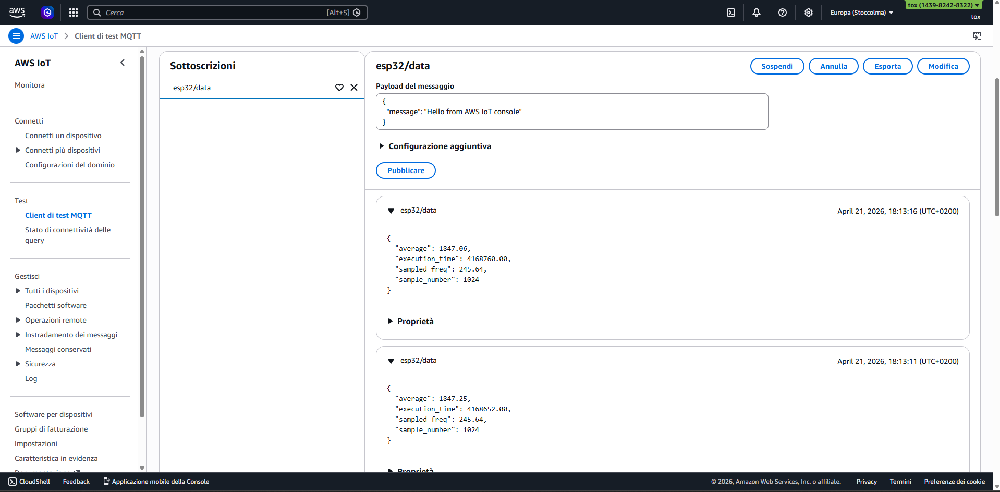
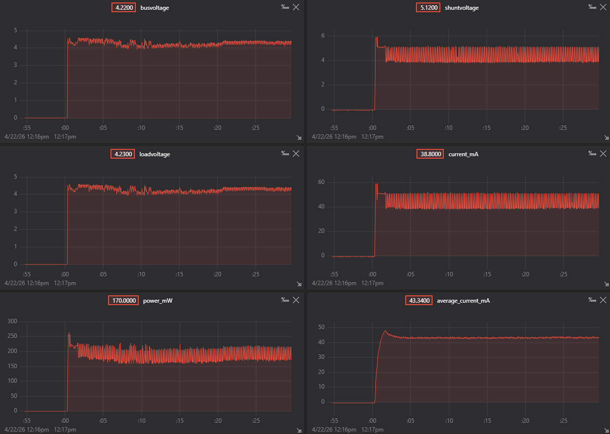
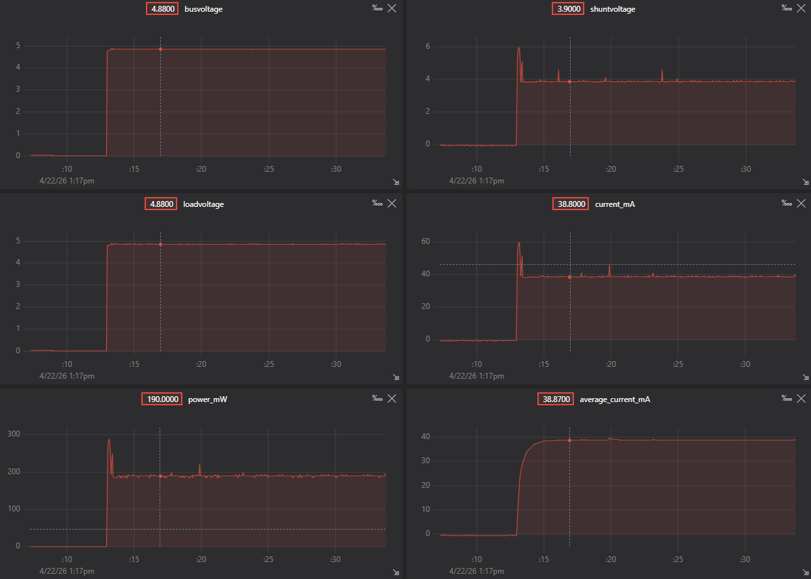
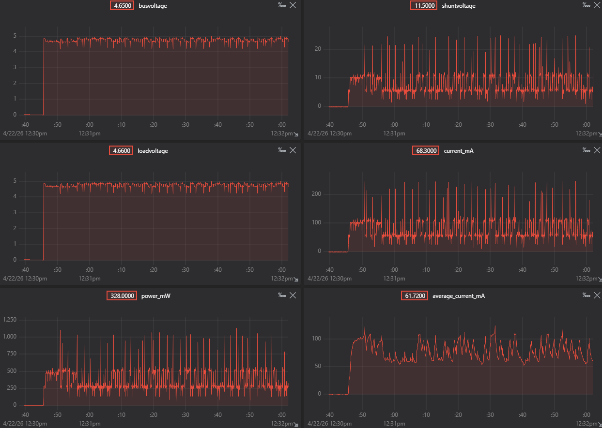
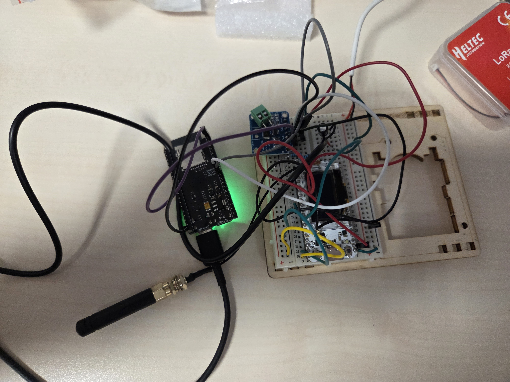

# IoT Individual Assignment

## Abstract

This file contains the documentation of the process to complete the assignment for the _"IoT Algorithms and Services"_ course of _"Sapienza Università di Roma"_.

The file contains all the requested points or at least the one i have been able to complete.

## Assumptions

The whole measuring was effettuated taking as input signal a $50Hz$ sinusoid.

## Assignment

### Maximum Sampling Frequency

#### Clock and vTaskDelay

During some experiments I found out that esp32 clock rate is setted to _10ms_. This fact implies that if `vTaskDelay()` is used to set the frequency, then it is impossible to sample faster then _1/0.01 Hz_ (_100Hz_).

It is possible to set clock rate down to 1ms, but the board will consume more energy, other options examined proved to be better.

In fact setting `vTaskDelay(pdMS_to_ticks(1))` will end up triggering the watchdog because the clock can not schedule faster the _10ms_.

#### Faster without DMA

Another sampling mode is to not use `vTaskDelay()` but `esp_rom_delay_us(delayus)`, this will allow us to achieve delays in the order of microseconds, enhancing the highest possible sampling frequency to:

$$1/10^{-6} Hz = 1000000 Hz$$

But this limit is only theorical because a single ADC read, performed using `adc_oneshot()` takes aproximately $54 \mu s$

So computing again the theorethical max frequency we get:

$$1/{10^{-6} s + 54 * 10^{-6} s} = 18181.82 Hz$$

This result can be measured:

### Optimal frequency

The code computes the __FFT__ over the samples passed from the _Sampler Task_ in a dedicated task, _FFT Task_.

_FFT Task_ is initializated when the board starts up and awaits for a notify from the _Sampler Task_. The __FFT__ is computed immediately after the _Sampler Task_ finishes its work and returns the frequency with more power and the highest one.

Finally the frequency is set:

$$adaptive\_sampling\_freq = highest\_freq * 5.0$$

to prevent data loss and to get a good reconstruction of the signal.

### Window aggregation

Samples are submitted either to the _FFT Task_ and the _Aggregator Task_.

The _Aggregator Task_ computes the average of the samples over a window of $1024$ samples.

Finally data is passed to the _MQTT Task_ which goal is to transmit data to the __AWS IoT Core MQTT__ through Wi-Fi.

### MQTT

Aggregated data transmitted contains:

1. `average`: the average value of the window.
2. `execution_time`: total time passed to sample the whole window.
3. `sampled_freq`: the sample frequency of the window.
4. `sample_number`: number of samples contained in the window.

## Evaluations

### Oversampling vs Adaptive

### Per-Window Execution Time

Per window execution time is measured at sampling time.

### Data Volume

Aggregating data and adaptive sampling reduce consistently data volume.

Data transmitted are contained in this struct that is transmitted between pseudo-costant time.

The code starts the sampling task every $10\mu s$ but most of the time is used in sampling the window.

#### Example

For a $50Hz$ signal the code will sample at $250Hz$.

Assuming $N\_SAMPLES = 1024$:

$$ sampling\_time = (1 / 250)s * 1024 = 4.096$$

As we can calculate, the code will have an execution time of nearly $4s$, so:

$$ data\_struct = 128 bit$$
$$ bit\_per\_s = 128 bit / 4 s = 32 bit/s$$

Instead of sending every single sample ($32bit$) that would take:

$$ {32bit*sample\_frequency} = 32bit * 250*{1/s} = 8000 {bit/s}$$

So aggregating data will make us send only $0.4\%$ of volume with respect to the original oversampling code.

### Energy Consumption

I measured the consuption of the esp while sampling at $18kHz$.

Then if we look at the measuring of the adaptive sampler.

We can compute that:

$$38.87mA / 43.34mA = 0.8968$$

So the adaptive sampler will consume $10\%$ less then the fast sampler.

I wan't able to measure the energy consumption of the whole code due to the fact that the my INA was not properly soldered and the esp continue restarting itself instead of working because of the energy peaks the WiFi require.

## Struct

## Bonuses

### Different Signals

Different signals with different frequencies should not affect the adaptive sampling.

In fact if the signal is correctly oversampled in the beginning the FFT should be able to compute the maximum frequency and then set the sampling frequency with respect to the highest frequency.
